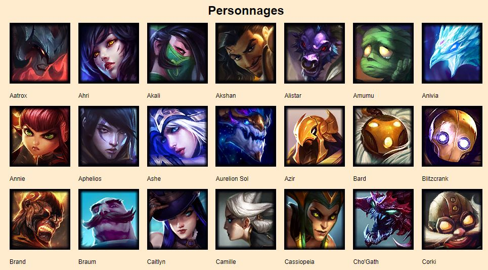
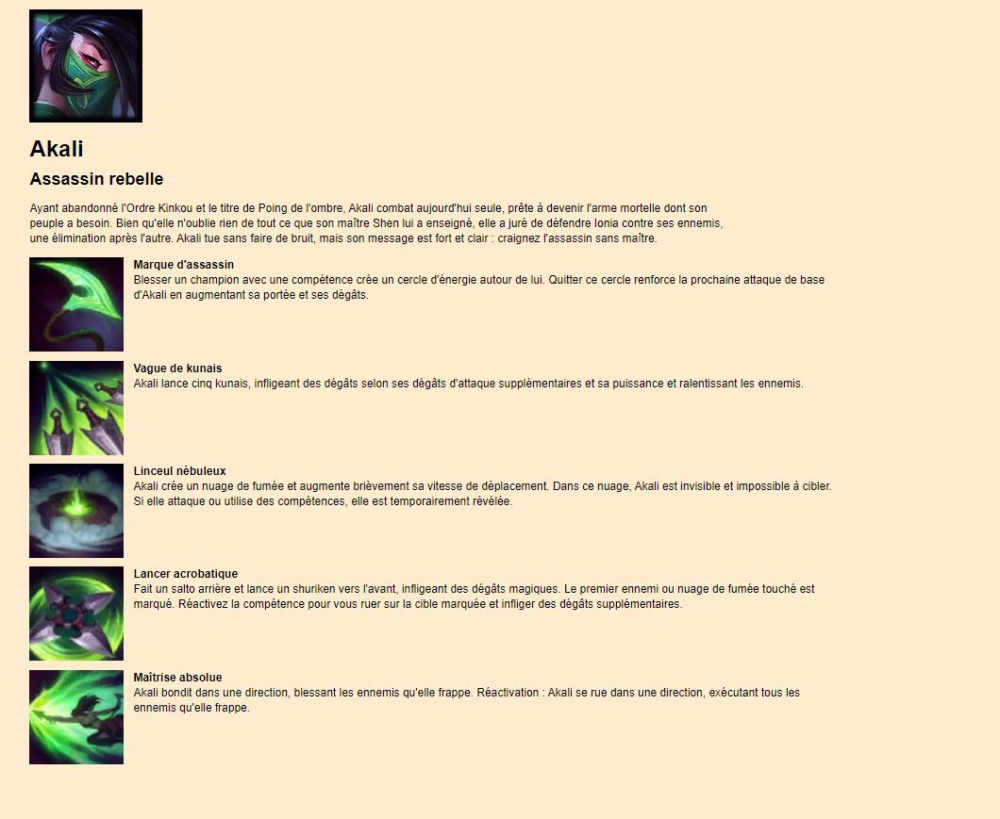

## 1. Description  

Ce projet présente simplement les personnages disponibles au sein du jeu League of Legends.  
Toutes les informations de ces personnages sont dynamiquement récupérées depuis une API externe.  

## 2. Technologies
- React
- JavaScript
- Node.js
- HTML/CSS
- API de Riot Games (https://developer.riotgames.com/docs/lol)

## 3. Utilisation  
Il est possible de le lancer sous Node.  
Pour lancer le projet :  
  - `cd ..\lol-web-react` 
  - `npm install`
  - `npm start`
 
 Dans un nouvel invite de commandes : 
  - `cd  \Client`
  - `npm install`
  - `npm start`

## 4. Images  

## 4.1 Liste personnages    
  

## 4.2 Présentation personnage  
  
